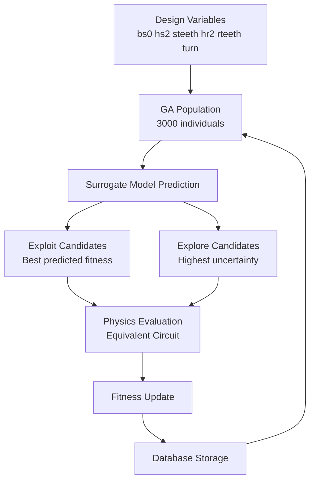

# ML-Assisted Genetic Algorithm for Motor Design Optimization

Surrogate-assisted optimization | Genetic Algorithm | Engineering Design

This project explores how **machine learning can accelerate genetic algorithm (GA) optimization** in engineering design problems.

Using **induction motor design optimization** as a case study, a surrogate machine learning model is integrated into the GA search process to reduce expensive physics evaluations while maintaining solution quality.

The result is a **ML-assisted Genetic Algorithm (MLGA)** framework that significantly reduces computation time with minimal impact on optimization performance.

---

# MLGA System Architecture



The surrogate model predicts the fitness of most individuals.  
Only a small subset of candidates are evaluated using the physics model.
---

# Key Results

| Method | Runtime (sec) | Physics Evaluations | Best Fitness |
|------|------|------|------|
| Pure GA | 1780 | 200,000 | -3.233 |
| MLGA | 758 | 60,000 | -3.317 |

Performance Summary:

- **~4.8× faster optimization**
- **~90% reduction in physics evaluations**
- **~1% difference in final solution quality**

These results demonstrate that surrogate-assisted optimization can significantly improve efficiency in engineering design tasks.

---

# Background

Induction motor design optimization involves tuning multiple geometric and electrical parameters to achieve better efficiency and torque characteristics while satisfying engineering constraints.

In traditional optimization workflows:

1. Genetic Algorithm generates candidate designs.
2. Each design is evaluated using a physics-based model.
3. Fitness values guide the evolutionary search.


GA Population
↓
Physics Evaluation
↓
Fitness
↓
Selection / Crossover / Mutation


When the population size and number of generations grow, the number of required evaluations increases dramatically.

Example:


Population = 3000
Generations = 100

Total evaluations = 300,000


Although equivalent circuit models are relatively fast, more complex engineering problems often require **finite element analysis (FEA)** or other expensive simulations.

---

# ML-Assisted Genetic Algorithm (MLGA)

To reduce computational cost, a machine learning surrogate model is introduced into the optimization process.

Instead of evaluating every candidate using physics calculations, the surrogate model predicts the fitness of most individuals.

Only a subset of candidates are evaluated using the full physics model.


GA Population
↓
ML Surrogate Prediction
↓
Exploit + Explore Selection
↓
Physics Evaluation (subset)
↓
Database Update


This approach preserves the exploration capability of GA while reducing the number of expensive evaluations.

---

# Optimization Strategy

## Pure GA

Population size:


3000


Generations:


100


Total physics evaluations:


300,000


---

## MLGA

Per generation physics evaluations:


150 exploit candidates
150 explore candidates


Total physics evaluations:


300 × 100 = 30,000


The remaining candidates use surrogate predictions instead of physics calculations.

---

# Experimental Observations

## Convergence Behavior

Pure GA converges slightly faster and achieves the best final fitness.

However, MLGA still reaches a **very similar solution** despite evaluating far fewer candidates.

---

## Population Quality

MLGA maintains a **better mean population fitness**, suggesting that surrogate predictions help guide the search toward promising regions of the design space.

---

## Database Reuse

The system maintains a design database to avoid recomputing identical candidate solutions.

Total database hits:


2827


This further reduces redundant evaluations.

---

# Repository Structure

```
mlga-motor-optimization/
│
├── README.md
│
├── data/
│ └── mlga_db_v1.csv
│
├── notebooks/
│ ├── 01_surrogate_training.ipynb
│ └── 02_mlga_experiment.ipynb
│
├── core/
│ ├── ga_core.py
│ ├── db_search.py
│ ├── ml_gate.py
│ └── evaluator.pt
│
└── results/
└── figures/
```

### data
Dataset used to train the surrogate model.

### notebooks
Experiment notebooks for training the surrogate model and running MLGA experiments.

### core
Core algorithm implementations.

### results
Generated plots and experiment outputs.

---

## Article Series

This repository accompanies a technical article series documenting the development of the MLGA framework.

The articles provide a more detailed explanation of the design decisions, experiments, and analysis behind this project.

The full series is written in **Chinese** and published on **Notion**.

EP1 – Original GA Optimization System  
Background and baseline GA architecture.

EP2 – Surrogate Model Training  
Dataset generation and machine learning model training.

EP3 – ML Gate Experiment  
Early attempts to use ML as a filtering gate.

EP4 – ML-Assisted Genetic Algorithm  
Final MLGA architecture and experimental results.

EP5 – Analysis and Future Work  
Discussion of results and possible extensions.

---

# Potential Future Work

Possible improvements include:

- adaptive physics evaluation budget
- improved uncertainty estimation
- multi-objective optimization (e.g. NSGA-II)
- integration with high-fidelity simulations such as FEA

---

# Key Takeaway

Machine learning can effectively assist evolutionary optimization in engineering design problems.

By introducing a surrogate model into the optimization loop:

- expensive evaluations can be dramatically reduced
- optimization speed can be significantly improved
- solution quality can remain close to the original algorithm

---

# License

MIT License
